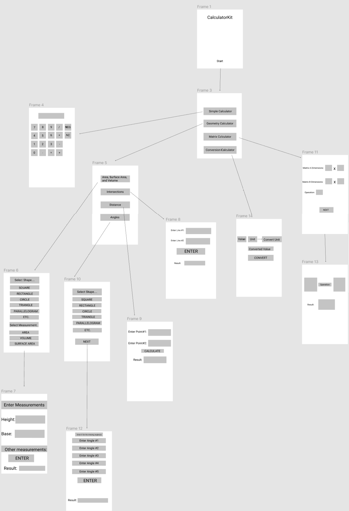

# Calculator Kit

## Table of Contents
1. [Overview](#Overview)
1. [Product Spec](#Product-Spec)
1. [Wireframes](#Wireframes)

## Overview
### Description
A calculator app that is featuring different calculators on Android phone.

### App Evaluation
- **Category:** Utilities / Tool
- **Mobile:** This app would be primarily developed for mobile but would perhaps be just as viable on a computer. Functionality wouldn't be limited to mobile devices, however mobile version could potentially have more features.
- **Story:** User will press start and then be naviagted to the options of calculators. After a calculator and other options are selected, inputs will be asked, a caculation will be processed, and a result will be outputted.
- **Market:** Any individual that needs to perform a calculation can use this app. This app can be very useful for students and math teachers.
- **Habit:** This app could be used anytime an individual needs to perform a calculation.
- **Scope:** This app will be on the google playstore.

## Product Spec
### 1. User Stories (Required and Optional)

**Required Must-have Stories**

* User inputs data and receives computated answers.
* Calculator has different screens and ability to perform their own tasks.
* User switchs between multiple calculator types.

**Optional Nice-to-have Stories**

* Computation history is saved even after the app is closed.
* Computation history can be cleared by the user.
* Results can be shared to other apps.
* User can click a button to save results to clipboard.

### 2. Screen Archetypes

* App introduction
* Selection - User select which calculator he/she want to use
   * Simple calculator
   * Geometry calculator
   * Matrix calculator
   * Conversion calculator
* Simple Calculator Screen
   * Performs addition, subtraction, multiplication, and division
* Geometry Calculator Screen 
   * Allows user to choose calculation and shape to perform geometry calculation
* Matrix Calculator Screen.
   * Allows user to input matrix dimension to solve matrix problem
* Conversion Calculator Screen
   * Allows user to choose from unit to unit to want to convert and calculate the answer.

### 3. Navigation

**Tab Navigation** (Tab to Screen)

* Simple calculator
* Geometry calculator
* Matrix calculator
* Conversion calculator


## Wireframes
<br>

## Schema 
### Models
#### Post

   | Property      | Type     | Description |
   | ------------- | -------- | ------------|
   | objectId      | String   | unique id for the user post (default field) |
   | author        | Pointer to User| image author |
   | image         | File     | image that user posts |
   | caption       | String   | image caption by author |
   | commentsCount | Number   | number of comments that has been posted to an image |
   | likesCount    | Number   | number of likes for the post |
   | createdAt     | DateTime | date when post is created (default field) |
   | updatedAt     | DateTime | date when post is last updated (default field) |
### Networking
#### List of network requests by screen
   - Home Feed Screen
      - (Read/GET) Query all posts where user is author
         ```swift
         let query = PFQuery(className:"Post")
         query.whereKey("author", equalTo: currentUser)
         query.order(byDescending: "createdAt")
         query.findObjectsInBackground { (posts: [PFObject]?, error: Error?) in
            if let error = error { 
               print(error.localizedDescription)
            } else if let posts = posts {
               print("Successfully retrieved \(posts.count) posts.")
           // TODO: Do something with posts...
            }
         }
         ```
      - (Create/POST) Create a new like on a post
      - (Delete) Delete existing like
      - (Create/POST) Create a new comment on a post
      - (Delete) Delete existing comment
   - Create Post Screen
      - (Create/POST) Create a new post object
   - Profile Screen
      - (Read/GET) Query logged in user object
      - (Update/PUT) Update user profile image
#### [OPTIONAL:] Existing API Endpoints
##### An API Of Ice And Fire
- Base URL - [http://www.anapioficeandfire.com/api](http://www.anapioficeandfire.com/api)

   HTTP Verb | Endpoint | Description
   ----------|----------|------------
    `GET`    | /characters | get all characters
    `GET`    | /characters/?name=name | return specific character by name
    `GET`    | /houses   | get all houses
    `GET`    | /houses/?name=name | return specific house by name

##### Game of Thrones API
- Base URL - [https://api.got.show/api](https://api.got.show/api)

   HTTP Verb | Endpoint | Description
   ----------|----------|------------
    `GET`    | /cities | gets all cities
    `GET`    | /cities/byId/:id | gets specific city by :id
    `GET`    | /continents | gets all continents
    `GET`    | /continents/byId/:id | gets specific continent by :id
    `GET`    | /regions | gets all regions
    `GET`    | /regions/byId/:id | gets specific region by :id
    `GET`    | /characters/paths/:name | gets a character's path with a given name
